# Lab-01-Robotica-2026-1

# Integrantes
1. Juan Andrés Moreno Benavides [jumorenobe@unal.co](Jumorenobe)
2. Mateo Ramos Cujer [mramoscu@unal.edu.co](MateoKGR)

# Informe

Indice:
1. [Diseño de la herramienta](#diseño-de-la-herramienta)
2. [Calibración](#calibración)
3. [Simulación](#simulación)
4. [Salidas y entradas digitales](#salidas-y-entradas)
5. [Implementación](#implementación)
5. [Conclusiones y trabajo futuro](#conclusiones)

## Diseño de la herramienta

En primera instancia, para el desarrollo del laboratorio tuvimos que realizar el diseño de la herramienta que ibamos a utilizar.
El diseño se realizó de acuerdo al modelo que nos fue mostrado en clase. Se desarrolló en inventor teniendo en cuenta toleracias para la rosca y el marcador que va adentro. 

Tuvimos en cuenta una toleracia de aproximadamente 10mm en la punta, y añadimos un resorte en el interior de la herramienta que empujara el marcador hacia afuera.

En el primer modelo que desarrollamos, la rosca no funcionaba muy bien debido a las tolerancias utilizadas por lo que fue necesario rediseñarla haciendola más resistente y con mejor ajuste.

A continuación una foto del modelo final desarrollado en inventor con mejor ajuste de tolerancia y una mayor resistencia.

  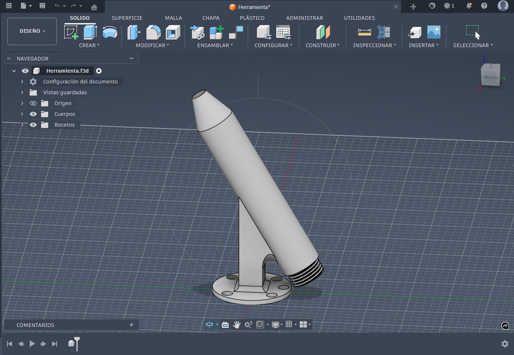

   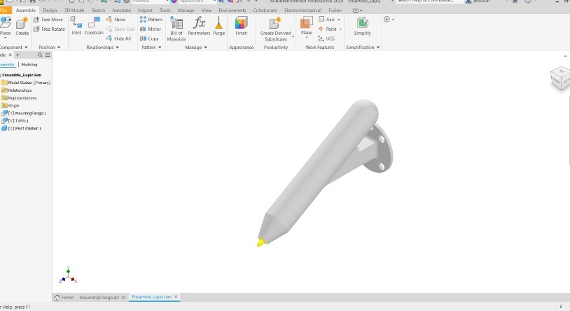

Planos de herramienta y planta que también se encuentran en este repositorio
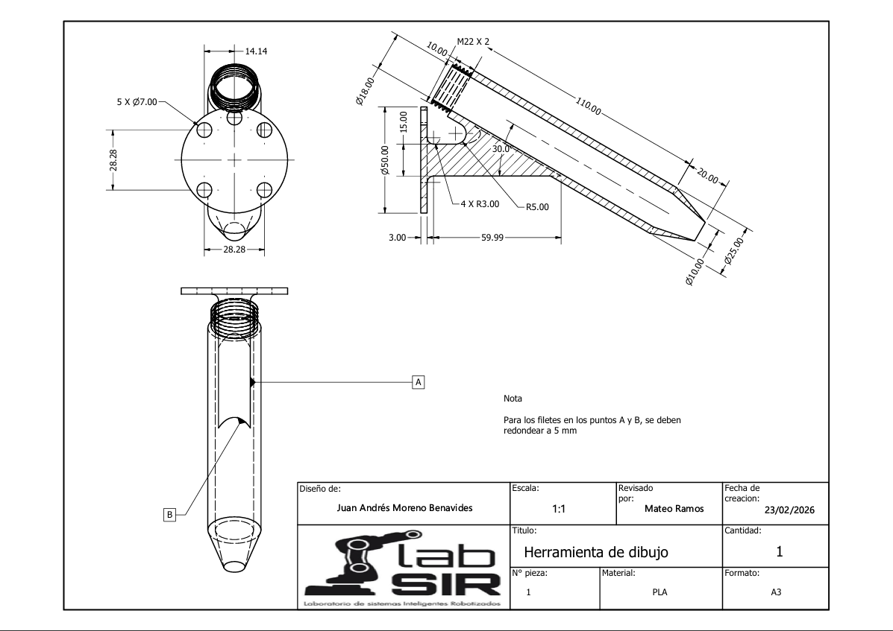
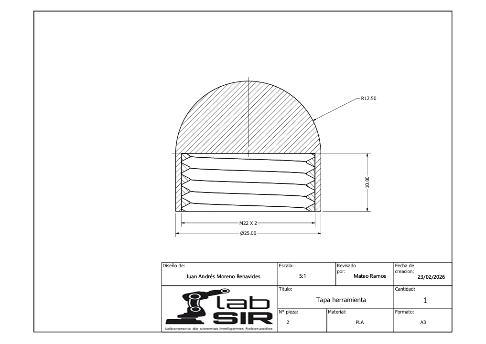
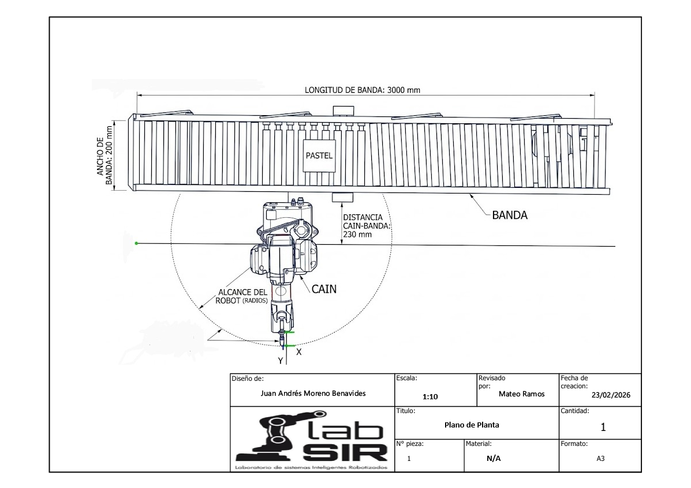

Foto de la herramienta montada en el robot.

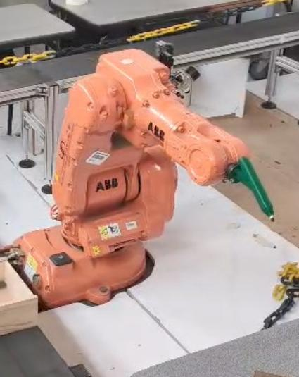

## Calibración
El proceso de calibración del robot con la herramienta nos tomó varias sesiones de práctica libre, inicialmente, nos daba un error de aproximadamente 15 o 20 milimetros, lo cual es demasiado teniendo en cuenta la toleracia de nuestra herramienta, sin embargo, en la tercera sesión ya con la práctica adquirida logramos tener un error de 7.9mm aproximadamente, lo cual es acorde a nuestra toleracia física de 10mm de nuestra herramienta mencionada en la sección anterior. 

A continuación la foto de la herramienta merequetengue_v2 en la pantalla del Flex Pendant. 
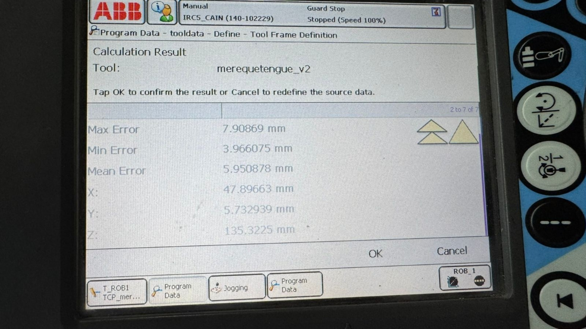

Durante la calibración del workobject, tuvimos un pequeño percanse con la herramienta, pues nos quedó mal la calibración y rompimos la herramienta. A continuación la prueba de la herramienta rota:
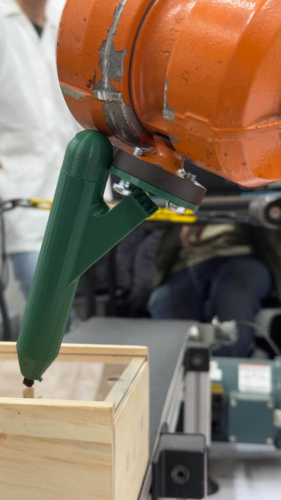

## Simulación
Respecto al manejo de Robot Studio, tuvimos que comenzar por modelar para despues importar los modelos CAD tanto de la herramienta (es decir nuestro tool) como del Workobject (el pastel) en inventor, utilimos una caja de madera de 20 cm de ancho, 20cm de largo y 9 cm de alto con un cristal en donde se iban grabar los nombres y logo con el marcador, Se muestra a continuacion nuestro workobject en fisico : 

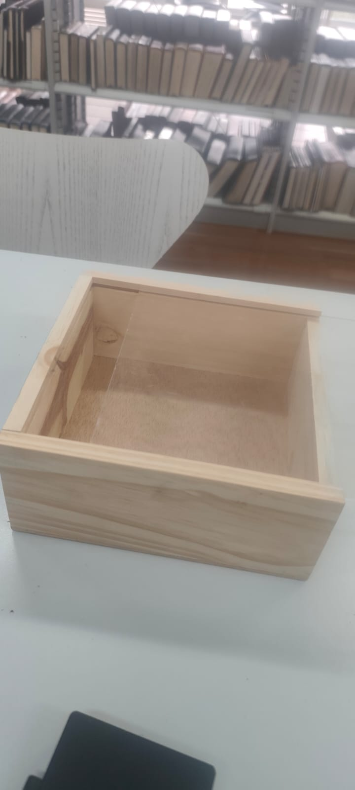

Es importante mencionar que diseñamos nuestros nombres y el logo con curvas relativamente sencillas tambien en el sofware Inventor para despues recrearlas en Robot Studio , Nos guiamos por el primer nombre de cada integrando del grupo y de logo un personaje principal de un videojuego famoso (Sans) como vemos a continuación:

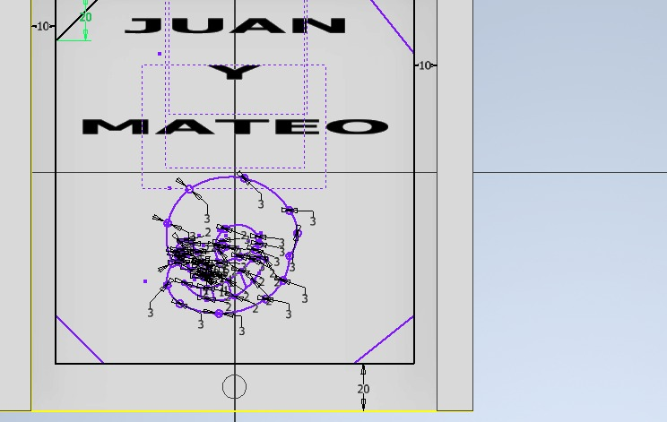

Dando Como Resultado final el siguiente WorkObject Listo para exportar a RobotStudio en formato .sat sugerido por el profesor para facilitar su manipulación :

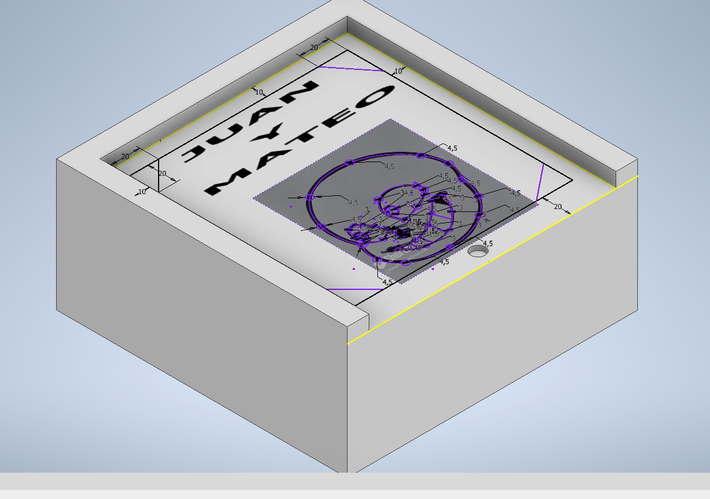

Ya en el RobotEstudio se observa de la siguiente manera tanto la herramienta como nuestro WorkObject ademas de importar una banda para hacer la simulación mas coincidente con la realidad:

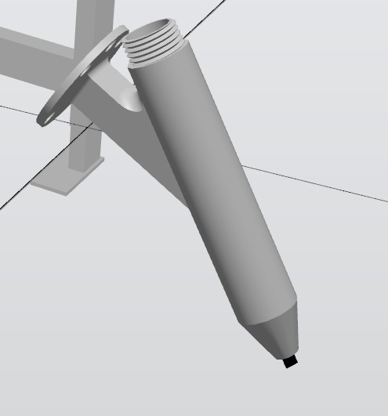

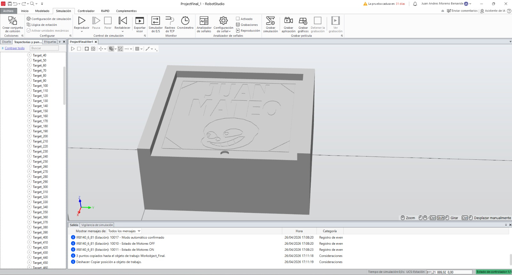

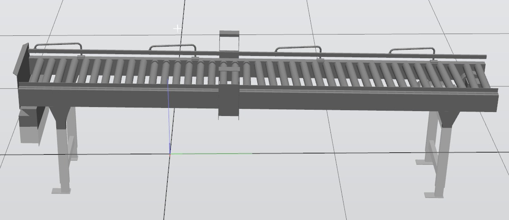

Configuramos nuestro tool dandole la orientacion al eje coordenado y acomplandolo en nuestro robot. Para el Work Object se ubico en la posicion dada en la vida real en sus cordenadas cortesianas y sus angulos respectivos al crearlo con el robot fisico para que tanto la simulación como la realidad estuvieran entrelazadas y no tener problemas de ubicación en el espacio, se presentaron algunos problemas ya que la banda nop esta del todo recta y se presentan inclinaciones que no son muy ligeras pero que de igual forma son importantes para ubicarla en el espacio en la posición real,Se muestra acontinuacion la ubicación de todos los objetos en el espacio de simulacion:

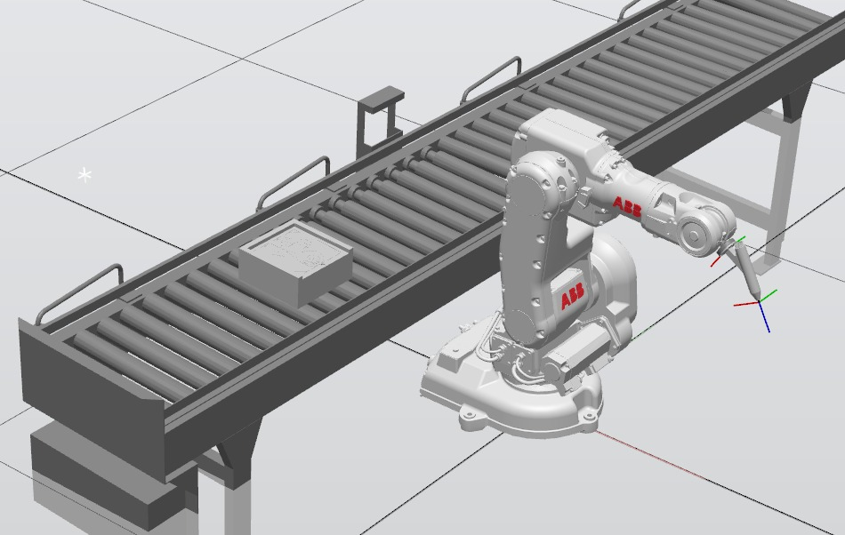

Una vez configurada la herramienta y el posicionado el workobject en el lugar que debería estar según el espacio de trabajo en el laboratorio en la banda transportadora, se comenazaron a crear los Targets, es decir los puntos que debían guiar al robot. Se crean  ubicandolos con las herramientas del sofware de manera más fácil,Se crea el Target_Home y un Target para la posición de mantenimiento Ademas para acercarse a la caja se creo un punto intermedio ya que el WorkObject tiene una forma irregular entre el tope de la madera y el vidrio que podria romper la herramienta asi que se hace crea un punto de aproximacion para evitar esto, al igual que se sube el marcador en cada cambio de letra para hacer notar la separación de esta , se tuvieron dificultades en el tema del logo ya que contaba con muchas curvas, igualmente el desarrollo fue exitoso creando 216 Targets que se presenta en en la siguiente imagen.

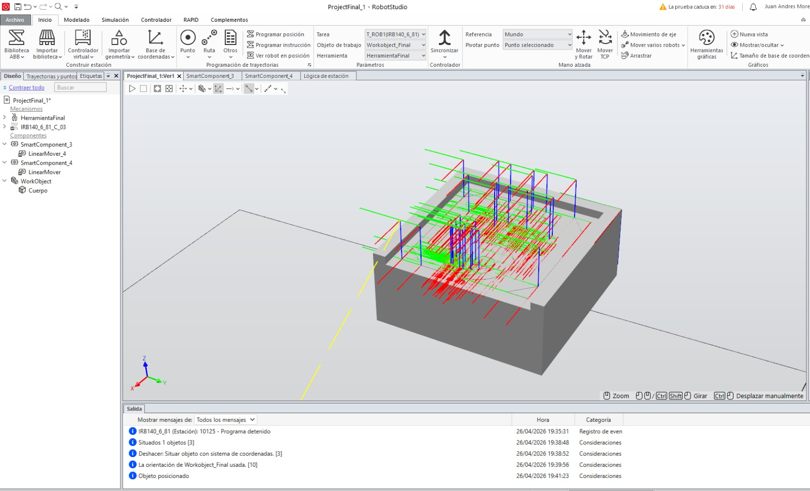

Configurados los Targets, se crearon los Paths entre los Targets, es decir, los caminos que debía seguir el robot para hacer el dibujo. Aquí es importante resaltar la importancia de crear bien los Targets, pues se debía alzar el brazo cada vez que se deseaba alcanzar una posición diferente dentro del workobject, de otra manera se pintarían lineas indeseadas. También se tuvo que utilizar diferentes comandos para hacer las lineas curvas o circulos, la instrucción MoveJ realiza desplazamientos rápidos por trayectorias curvas entre puntos mediante el movimiento coordinado de las articulaciones; MoveL mueve la herramienta en línea recta garantizando precisión en trayectorias como líneas o figuras; y MoveC permite describir trayectorias circulares o arcos suaves entre dos posiciones intermedias, Se creo un path diferente para cada letra y para cada detalle del logo para simplificar la solución de errores ademas se creo un borde en el pastel para asemejar el dibujo a un cuadro, despues se comentaria esta linea ya que seria muy riesgoso para la herramienta debido a su cercania con difernetes topes del WorkObject, a continuacón se presentas los diferentes paths con  las tres posiciones, home, mantenimiento y escritura

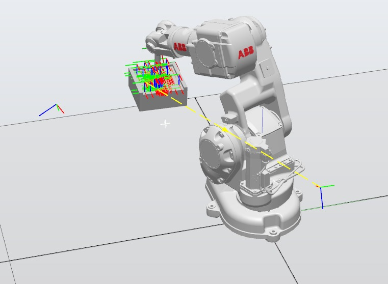

En la imagen se observan todos los sistemas coordenados (orientados en la misma dirección) de los Targets creados junto con los Paths que debía seguir el robot (las líneas amarillas). 

Una vez hechos los Paths y los Targets se sincronizó la estación con el código para poder ajustar el código de rapid de manera que la simulación sirviera. Importante tener en cuenta que estuvieran creados tanto los Target como los Paths en el código. (El código se encuentra adjunto en este repositorio en la ruta code\rapid\lab01_main.mod)

A continuación el diagrama de flujo del código final.
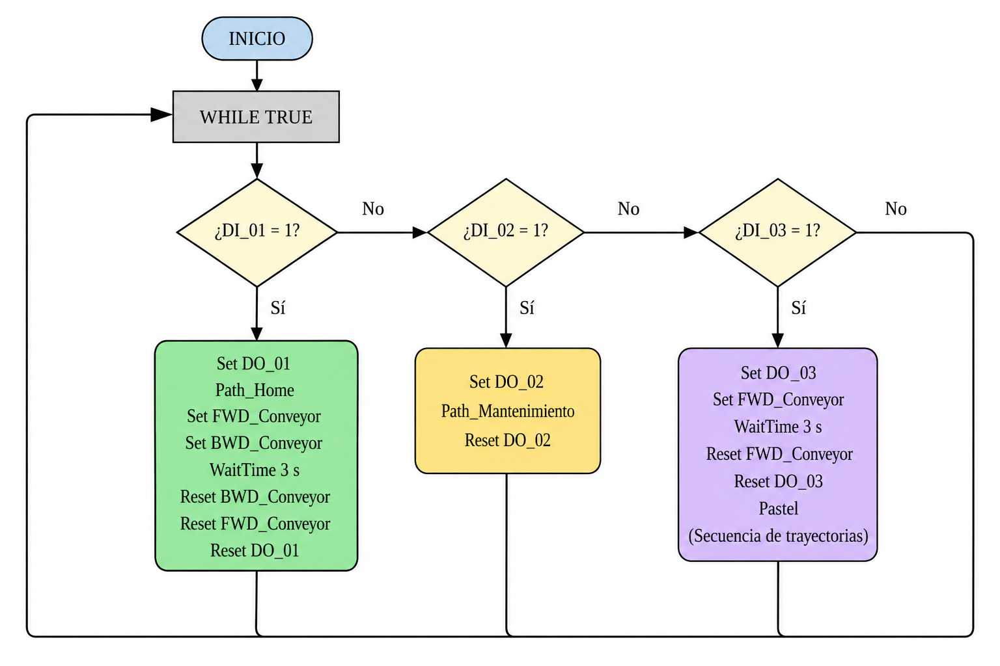

A continuación la simulación en Robot Studio.
[Descargar video de simulación](videos/videosimulacion.mp4)
Hacer click en la imagen para ver el video
[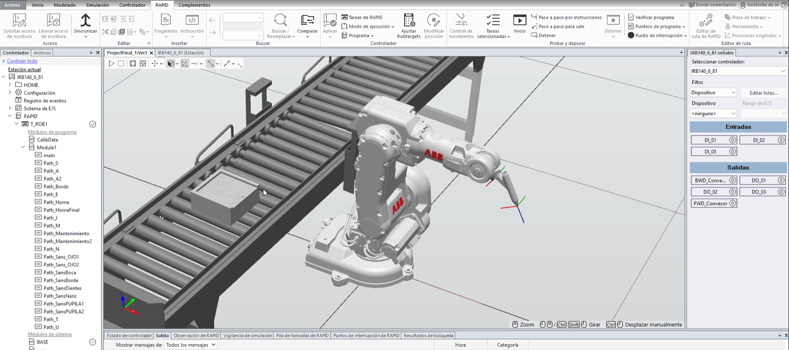](https://drive.google.com/file/d/1iKCL7Am2xYt6DjFr-hjv4zW74DocM8NU/view?usp=sharing)

## Salidas y entradas digitales
Existen diferencias clave entre la simulación y la vida real. En la vida real, la entrada digital acciona directamente un circuito de control que activa el motor de la banda transportadora. En cambio, en la simulación, mediante el uso de smart components, se genera el movimiento de la caja, lo que nos da la sensación de que esta se está desplazando.

Por otro lado, es evidente que en la vida real las entradas están físicamente conectadas al controlador mediante pulsadores, mientras que en la simulación debemos crear dichas entradas y salidas de forma virtual. Además, es a través del I/O Simulator que se obtienen y gestionan esas señales.

Para la simulación se realizaron Dos SmartComponents para simular como la banda se atrasa y como se adelanta estas como la banda real dependian de 2 condiciones en sus entradas que era el Forward y el backward de la banda , en la vida real para hacer avanzar la banda se necesitaba el Forward  en 1 y el Backward en 0 , mientras que para hacerla atrasar se necesitaban los dos en 1 esto se logro con un movimiento lineal de los Dos SmartsComponents en direcciones diferentes con una velocidad de 160 m/s , cada uno era ativado con compuestas ands en donde en el primer caso era simp,emnete las 2 entradas sin modificar y en el otro caso se utilizo una compuerta not para negar la entrada del bakcWard , Acontinuacion se presentan todas las configuraciones Usadas : 

Dos SmartsComponents : 

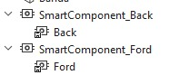

Entrelazamiento De señales :

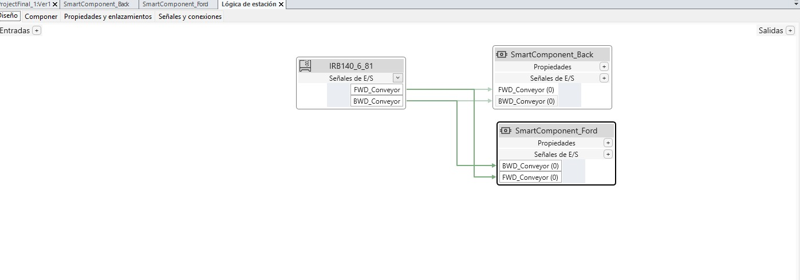

Forward :

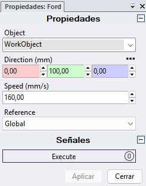

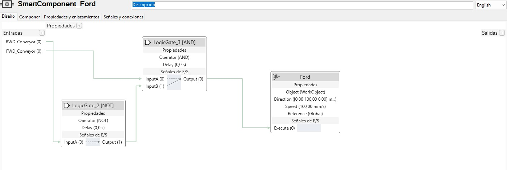

BackWard :

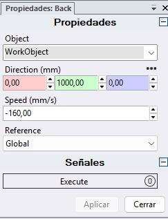

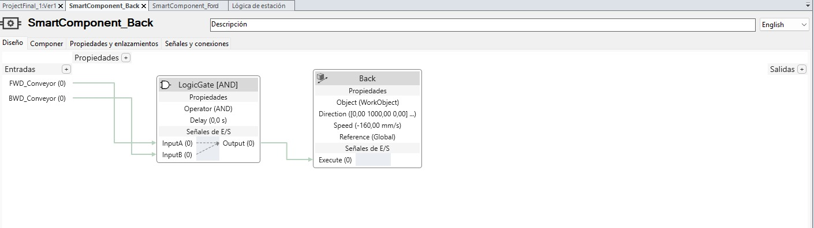

## Implementación
Respecto a la implementación, tuvimos que comunicarnos con el controlador a través de un cable UTP para poder utilizar nuestra rutina, en principio, el reto fue lograr calibrar en el espacio de trabajo el WorkObject para que el robot fuera preciso en llegar y hacer la figura en nuestro WorkObject de la vida real, el cual, como el modelo CAD que hicimos, era una caja de 20x20x5cm.
Después de iterar varias veces, logramos ajustar con precision el robot con el WorkObject y ejecutamos la rutina teneindo en cuenta las salidas y entradas digitales también. 

Por último el video final de la implementación completa
[Descargar video de implementación](videos/demostracionfinal.mp4)
Hacer click en la imagen para ver el video
[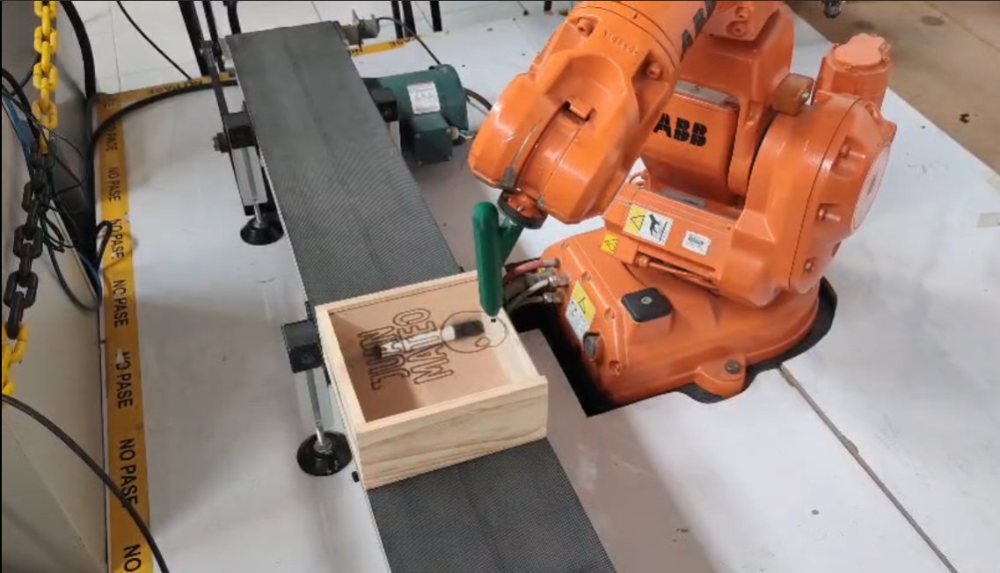](https://drive.google.com/file/d/1kKiyHdp7_Y21EuEeG2vPirhTzsbhvJkJ/view?usp=sharing)

A continuación se puede ver en mejor detalle el dibujo final Obtenido :

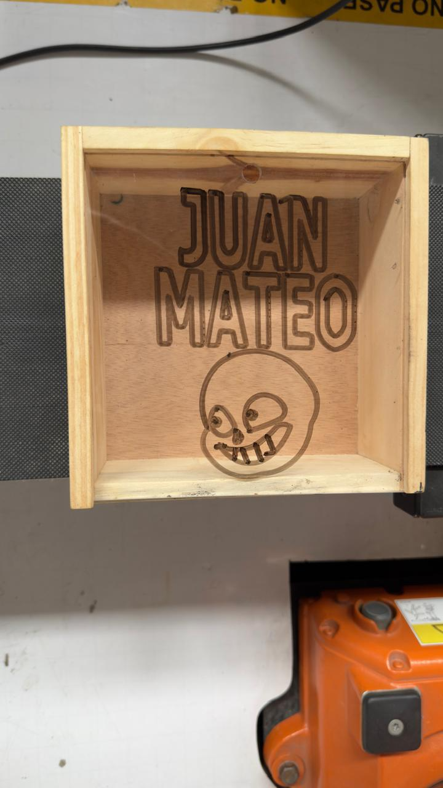

## Conclusiones y trabajo futuro

En este laboratorio aprendimos a calibrar la herramienta (TCP), generar trayectorias complejas usando MoveJ, MoveL y MoveC, y a integrar señales de E/S digitales para activar rutinas del robot. Aunque hubo desafíos con tolerancias y rutas de herramientas, lograr que el robot dibujara correctamente las letras fue muy satisfactorio. Para trabajos futuros nos gustaría optimizar la fluidez de las trayectorias (reducir movimientos innecesarios), mejorar la robustez de la herramienta frente a variaciones pequeñas, y añadir funciones de detección de fallas o retorno seguro automático si alguna señal no es válida.

